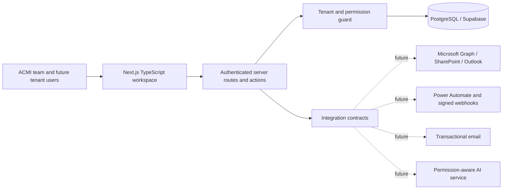
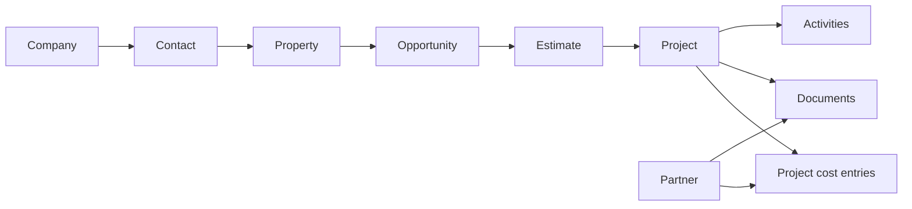

# Architecture — ACMI Construction OS

## Product boundary

The MVP is a contractor operating layer spanning lead intake through warranty. It unifies daily visibility while preserving formal systems of record until integrations are implemented and verified.

## Layers

### Presentation

`app/components/ContractorOS.tsx` is the interactive MVP shell. It contains all requested modules and uses `lib/demo-data.ts` while the repository layer is not connected. The role switcher is a UX preview; server-side authorization remains mandatory for every real read and write.

### Server boundary

App Router endpoints under `app/api` establish JSON server behavior. Future mutations should use authenticated server actions or routes that:

1. resolve the user from Supabase Auth;
2. resolve the active tenant from the session or URL;
3. assert membership and the required resource/action permission;
4. execute a tenant-scoped query;
5. record a safe audit event; and
6. emit integration events only after the database transaction succeeds.

### Domain and access

`lib/auth/permissions.ts` provides a resource/action permission matrix for:

| Role | Intended foundation |
|---|---|
| Administrator | Full tenant configuration and data access |
| Project Manager | Production, documents, tasks, and operational cost visibility |
| Estimator | CRM context, opportunities, estimates, documents, and read-only production context |
| Field Crew | Assigned projects, field documents, photos/tasks, and limited updates |
| Accounting | Read operations plus controlled cost/document updates |
| Read Only | Tenant-scoped read access |

Database Row Level Security is the backstop. The first migration provides tenant isolation and broad role gates. Before production, replace broad write policies with table-specific policies or trusted server actions for sensitive fields such as contract value, cost, membership, and integration configuration.

### Data

The PostgreSQL schema uses required `tenant_id` foreign keys on every operational record. Cross-tenant joins are prevented by application query conventions and RLS membership checks. Production hardening should add composite foreign keys where practical so related records must share the same tenant at the database constraint level.

Primary domain flow:

## Multi-tenant model

- A `tenant` represents one contracting organization.
- A Supabase Auth user has one `profile`.
- `memberships` connect users to tenants and assign one role per tenant.
- All business records include `tenant_id` and are filtered at the database layer.
- The active tenant must be explicit in server context; never trust a browser-provided tenant ID without membership verification.
- Background jobs use a service role only on the server and must supply the tenant context explicitly.

## Job-cost model

`projects` holds the fast operational snapshot: contract amount, original estimate, commitments, actual cost, forecast, and change-order totals. `project_cost_entries` holds traceable budget, commitment, actual, forecast, and change-order records by cost code.

When an accounting system is connected:

- treat accounting as authoritative for posted actuals;
- store the external ID and source system on imported records;
- make imports idempotent;
- retain operational forecasts in the contractor OS;
- show freshness and reconciliation status in the UI; and
- never silently overwrite approved manual corrections.

## Integration contracts

`lib/integrations/contracts.ts` defines stable interfaces without credentials:

- Microsoft 365: SharePoint documents and Outlook calendar events
- Email: proposal delivery and notifications
- Automation: versioned Power Automate/webhook events
- AI: tenant-scoped questions with record citations

Recommended implementation pattern:

1. OAuth or provider secrets live in Supabase Vault or the hosting secret store.
2. `integration_connections` stores status and non-secret configuration only.
3. Inbound events are verified, persisted to `webhook_events`, and processed idempotently.
4. Outbound events include tenant ID, event version, correlation ID, timestamp, and signature.
5. Provider failures are retried with limits and surfaced to an administrator.

## Microsoft 365 target mapping

| ACMI OS concept | Microsoft 365 target |
|---|---|
| Project document metadata | SharePoint document library item |
| Project folder | SharePoint folder keyed by stable project ID |
| Inspection/site meeting | Outlook calendar event |
| Proposal or task notification | Outlook or approved transactional email provider |
| Approval workflow | Power Automate trigger with signed callback |

SharePoint/OneDrive stores the file; the contractor OS stores the stable external identifiers, version, category, related record, and synchronization status.

## AI guardrails

- Retrieve only records authorized for the active tenant and role.
- Cite internal records in each answer.
- Treat generated emails, estimates, change orders, and status reports as drafts requiring human approval.
- Exclude secrets and highly sensitive fields from prompts.
- Log model, request class, record scope, and approval outcome without logging unnecessary private content.

## Deployment environments

Use separate local, preview, and production Supabase projects. Never reuse production service keys in preview. Run migration checks and two-tenant RLS tests before promoting schema changes. The UI build is Cloudflare Worker-compatible; PostgreSQL/Supabase remains an external managed service reached from server code.
